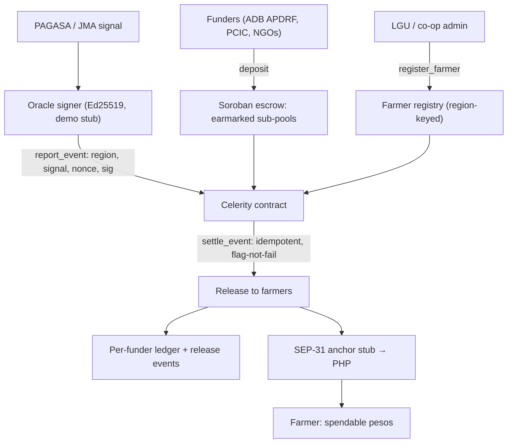

<h1 align="center">Celerity</h1>

<p align="center">
  <strong>Disaster money that moves itself.</strong>
</p>

<p align="center">
  A programmable disaster-disbursement rail on Stellar — many funders, one signed
  weather trigger, instant payouts to registered farmers.
</p>

<p align="center">
  
  
  
  
</p>

<p align="center">
  
  
  
  
  
</p>

---

## Celerity

Celerity is a programmable disaster-disbursement rail on Stellar. Funders deposit into a
shared on-chain escrow, each with an earmarked sub-pool and its own release rule. When an
objective, signed weather event (a typhoon signal from an authorized oracle key) fires,
the smart contract releases payouts automatically to pre-registered farmers, cashes out to
PHP through a Stellar anchor, and logs every movement so each funder can see exactly where
its money went. No agency hand-off, no physical check, no waiting.

It is **not** a crop insurer and **not** a faster claims processor — it is the multi-funder,
cross-border settlement layer *underneath* them.

> **Key links**
>
> - **Live contract (Testnet):** [`CBSXZ6TK…NESDG`](https://stellar.expert/explorer/testnet/contract/CBSXZ6TKWW5Y726ZBWC4BXSKTLW77VBXUNS4LBJA3SDDWPDXINGNESDG)
> - **Pitch & spec:** [`Celerity_Hackathon_Doc.md`](Celerity_Hackathon_Doc.md)
> - **Design rules & win condition:** [`CLAUDE.md`](CLAUDE.md)
> - **Design system:** [`design.md`](design.md)
> - **On-chain QA sweeps:** [`qa-reports/`](qa-reports/)

---

## Problem

When a typhoon destroys a farmer's crop, the money to help them recover usually *already
exists* — in a national crop-insurance fund, a regional disaster pool, or an NGO earmark.
What's slow and lossy is the last mile.

| Pain point | What it costs |
| --- | --- |
| Payouts distributed as physical checks at regional offices | Farmers wait weeks after the claim is even approved |
| Single-funder, peso-only insurers | Foreign USD disaster capital can't reach a farmer directly |
| No way for an outside funder to verify disbursement | Money routes through agencies with no audit trail |
| Uninsured / unregistered farmers | No fast path at all |

The root problem: the money exists, but turning it into cash in a farmer's hands takes
layers of intermediaries. Celerity collapses that into one flow — **fund, trigger, pay.**

## Solution

Funders deposit into a shared Soroban escrow, each deposit earmarked as a sub-pool with its
own payout rule and recipient scope. An authorized oracle submits a **signed** weather
event (region, typhoon signal). The contract verifies the signature and compares numbers —
it never reads or interprets a document. For every sub-pool whose condition the event meets,
it releases the payout to the registered farmers in that region, on the funder's schedule,
and logs a per-funder ledger entry. Payouts convert to spendable pesos through a Stellar
anchor at the edge.

**Core claim:** a national insurer, a regional fund, and a foreign foundation can co-fund the
same typhoon trigger and pay a farmer instant, spendable pesos — with no agency hand-off and
every peso auditable.

## How It Works

1. **Funders deposit into earmarked sub-pools.**
   Each `deposit` creates a sub-pool: a balance plus a rule (region, signal threshold, payout,
   installment schedule). Balances never commingle; one funder's release, pause, or exhaustion
   never touches another's.

2. **An LGU/co-op admin registers farmers.**
   `register_farmer(address, region)` maintains the beneficiary list. The contract pays only
   registered addresses in the triggered region — it doesn't decide who's a farmer, it pays a
   verified list.

3. **A signed weather bulletin enters the contract.**
   The oracle signs `region · signal · nonce` with an Ed25519 key; `report_event` verifies it
   against the stored oracle public key. A real typhoon hits many regions at once, so the app
   ingests a bulletin and signs **one event per region**.

4. **Settlement releases every matching sub-pool at once.**
   `settle_event` iterates matching sub-pools and pays each registered farmer — idempotent on
   `(event, farmer, pool)` so a replay never double-pays, and *flag-not-fail* so a dry pool is
   marked `Exhausted` and skipped rather than reverting everyone else's release.

5. **Farmers claim recurring installments on schedule.**
   Recurring pools release the first installment at settlement; the farmer pulls the rest with
   `claim` on the pool's own cadence.

6. **Value cashes out to PHP and every release is logged.**
   Released value routes through a SEP-31 anchor to spendable pesos, and `funder_ledger` gives
   each funder a per-release, on-chain record.

## Features

### Smart Contract (live on Testnet)

- **Shared escrow, isolated sub-pools** — many funders, one contract; `deposit`, `top_up`,
  `withdraw_unspent`, `pause_pool` / `resume_pool`, all funder-auth scoped.
- **Signed oracle trigger** — `report_event` verifies an Ed25519 signature and a nonce; the
  contract compares numbers, never reads a document. Replays are rejected.
- **Idempotent multi-funder release** — `settle_event` pays every matching pool once, keyed on
  `(event_id, farmer, pool_id)`; a re-run after a top-up pays only whoever was missed.
- **Flag-not-fail** — an underfunded pool is flagged `Exhausted` and skipped; one funder's dry
  pool never reverts another's payout. `top_up` cures the flag.
- **Recurring installments** — `claim` pulls the next tranche on the pool's cadence; hard-stops
  at the installment count; a paused pool blocks the claim.
- **Farmer registry** — admin-auth `register_farmer` / `remove_farmer`, region-keyed.
- **Per-funder ledger** — `funder_ledger` and one `release` event per (funder, farmer).

### Funder Console (React)

- **Login-first, GCash-style** — pick an institution (ADB APDRF / PCIC), then an escrow hero,
  circular quick-actions, and a release feed grouped by signed event.
- **Strict funder isolation** — the dashboard is scoped to the logged-in funder; the other
  funder's pools and ledger never appear.
- **Escrow pools** — island-grouped (Luzon / Visayas / Mindanao), status-mix pills, plain-language
  release rules, and a typhoon-context banner.
- **Trigger Typhoon** — drop a signed PAGASA-style JSON bulletin; the app shows region-by-region
  what will settle vs. skip, then signs and settles each matching region.
- **Farmers registry** — read-only for funders, with an explicit LGU registrar mode that signs
  with the admin key.

### Farmer App + Transparency

- **Farmer view** — wallet total, receipts, recurring-installment claims, and a labeled SEP-31
  anchor cash-out to PHP.
- **Public transparency ledger** — every release across all funders, no login required.

### Honest Stubs (clearly labeled)

- **Live PAGASA/JMA feed** — a Node.js Ed25519 signer stands in for the authorized weather feed.
- **Licensed anchor cash-out** — a SEP-31 receiver mock stands in for a licensed VASP (e.g.
  Coins.ph). Everything on-chain is real; only the fiat conversion is simulated.

## Architecture



## Tech Stack

| Layer | Technology |
| --- | --- |
| Smart contract | Soroban (Rust), deployed to Stellar Testnet |
| Frontend | React + Vite, `@stellar/stellar-sdk` (≥ 16), plain inline-style design system |
| Oracle signer | Node.js Ed25519 (simulates a PAGASA/JMA-role authorized key) |
| Settlement token | Native XLM SAC (a USD stablecoin in the production narrative) |
| Anchor | Stubbed SEP-31 receiver for USD/stablecoin → PHP |
| Network | Stellar Testnet — every on-chain step verifiable on stellar.expert |

## Repo Layout

```text
contracts/celerity/       Soroban smart contract (Rust)
  src/lib.rs              Data model + full function surface
  src/test.rs            Unit / adversarial tests (idempotency, isolation, dry-pool)
celerity-web/            React frontend
  src/pages/funder/      Login, home, pools, oracle (bulletin drop), ledger, registry, settings
  src/pages/farmer/      Farmer app: home, activity, cash-out, profile
  src/pages/transparency/ Public transparency ledger
  src/design/            Design-system components + tokens.css
  src/lib/               celerity.js (contract client), regions.js, funders.js, anchor.js
oracle/                  Node.js Ed25519 oracle signer (demo stub for the weather feed)
tools/seed-demo.mjs      Repeatable demo-slate seed (pools + farmers, no event fired)
qa-reports/              On-chain QA sweeps, per phase
deployments.json         Public Testnet deployment metadata + contract-id history
```

## Run Locally

### Frontend

```bash
cd celerity-web
npm install
cp .env.example .env   # fill in: contract ID from deployments.json, demo secrets
                       # from `stellar keys show <name>` + oracle/.env
npm run dev
```

The UI signs with throwaway Testnet demo identities from `.env` (gitignored) — no wallet
extension to flake on stage. Requires `@stellar/stellar-sdk` ≥ 16 (older majors can't parse
current-protocol transaction metadata).

### Prerequisites (contract build / deploy)

- Rust ≥ 1.84 with the `wasm32v1-none` target (`rustup target add wasm32v1-none`)
- Stellar CLI (`cargo install stellar-cli`) — this repo used v27
- A funded Testnet identity named `alice` (`stellar keys generate alice --network testnet --fund`)

### Build, test, deploy

```bash
# Build the contract to Wasm
cd contracts/celerity && stellar contract build

# Run the test suite (46 tests, adversarial cases included)
cargo test

# Deploy to Testnet. The constructor runs atomically at deploy — admin, oracle
# Ed25519 pubkey (hex), and settlement token (SAC address) are set with no
# separate init call to front-run.
stellar contract deploy \
  --wasm target/wasm32v1-none/release/celerity.wasm \
  --source-account alice --network testnet -- \
  --admin "$(stellar keys address alice)" \
  --oracle <64-hex-char Ed25519 pubkey> \
  --token CDLZFC3SYJYDZT7K67VZ75HPJVIEUVNIXF47ZG2FB2RMQQVU2HHGCYSC
```

### Seed a demo slate

After a fresh deploy, seed pools + farmers (leaves everything **Armed** with an empty
ledger, so the typhoon is triggered live):

```bash
cd celerity-web && node ../tools/seed-demo.mjs
```

## Demo Flow

1. Open the funder console and log in as **ADB APDRF**; tap the **PCIC** switcher and watch the
   whole dashboard re-scope — strict funder isolation.
2. On **Escrow Pools**, read a plain-language rule: *"When typhoon signal ≥ 3 hits Bicol →
   release the payout per registered farmer."* (Demo amounts are small Testnet XLM shown as
   pesos at a fixed demo rate, so the escrow doesn't drain the demo accounts.)
3. In **Farmers (LGU)**, show the registry belongs to the government, not the funders.
4. Open **Trigger Typhoon**, drop the PAGASA bulletin, and watch it settle every matching region
   at once — one signed bulletin, many releases.
5. Jump to the **Ledger** and the **farmer app**: the money has already arrived, and every release
   is one click from stellar.expert.
6. Run the farmer's balance through the labeled **SEP-31 anchor stub** to spendable pesos.

## Environment

`celerity-web/.env` (gitignored — copy from `.env.example`):

| Variable | Required | Purpose |
| --- | --- | --- |
| `VITE_RPC_URL` | yes | Soroban Testnet RPC |
| `VITE_NETWORK_PASSPHRASE` | yes | Testnet passphrase |
| `VITE_CONTRACT_ID` | yes | Deployed contract id (from `deployments.json`) |
| `VITE_FUNDER_SECRET` | yes | Funder + registry admin demo key (alice) |
| `VITE_FUNDER2_SECRET` | yes | Second funder demo key (PCIC / mallory) |
| `VITE_FARMER_SECRET` | yes | Farmer demo key (farmer1) |
| `VITE_ORACLE_SECRET` | yes | Oracle signer key (same as `oracle/.env`) — powers the in-app trigger |

## Team

**Ethan Dreiz Baltazar**
Builder, designer, and developer of Celerity.

- GitHub: [thanreiz](https://github.com/thanreiz)

## Notes

- Never print, log, or commit a secret key. The oracle signer's key is generated and injected,
  never hardcoded; `.env` and `oracle/.env` are gitignored.
- The oracle feed and the anchor cash-out are deliberate, clearly-labeled stubs — everything
  else (escrow, trigger verification, multi-funder release, registry, ledger, claim) is real and
  live on Testnet.
- Contract IDs are public and safe to commit; they live in `deployments.json`, with every prior
  redeploy preserved under `previous_contract_ids`.

---

> **Status:** Phase 5 — the end-to-end story is clickable. A signed typhoon bulletin releases
> multiple independently-funded sub-pools to registered farmers, live on Stellar Testnet,
> idempotently, with a per-funder ledger and a labeled anchor cash-out. Funder console redesigned
> login-first with a multi-region bulletin trigger; running on a fresh, seeded demo contract.
